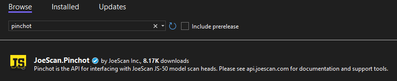

# JoeScan Pinchot .NET API
The JoeScan Pinchot .NET API is the interface to JoeScan JS-50
scan heads. This API allows users to develop software to run on a desktop
computer and control scan heads that are connected to the same network.
Please see the [Developer Portal](https://api.joescan.com/) for downloads,
software references, and system documentation.

The easiest way to start using the Pinchot API in your project is by installing the
[NuGet package](https://www.nuget.org/packages/JoeScan.Pinchot) that is provided
with every release. Search "pinchot" in Visual Studio's NuGet Package Manager
window to quickly install the Pinchot API into your runtime.

## Support
For direct support for the JoeScan Pinchot API, please reach out to your
JoeScan company representative and we will provide assistance as soon as
possible. The [GitHub](https://github.com/JoeScan-Inc/pinchot-net-api) page for
this project is also monitored by developers within JoeScan and can be used to
post issues and open pull requests.

## Building Source
The JoeScan Pinchot API is open sourced on [GitHub](https://github.com/JoeScan-Inc/pinchot-net-api).
In order to build the API and software examples in Windows 10 or 11, Visual
Studio 2022 with the .NET 6 Runtime (".NET desktop development" workload in
Visual Studio Installer) is needed.

## Links
* [Documentation](https://api.joescan.com/doc/v16/net/JoeScan.Pinchot.html)
* [Developer Portal](http://api.joescan.com)
* [Latest Release](http://api.joescan.com/release)
* [GitHub Source](https://github.com/JoeScan-Inc/pinchot-net-api)
* [JoeScan Homepage](https://joescan.com)
* [NuGet.org Reference](https://www.nuget.org/packages/JoeScan.Pinchot)
* [License](https://github.com/JoeScan-Inc/pinchot-net-api/blob/master/LICENSE.txt)
