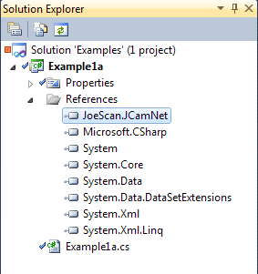

# Developing Applications With The .NET/C# API  

## Visual Studio and .NET Versions

* .NET Core 3.0 and Visual Studio 2019 highly recommended  
* .NET Standard 2.0 and Visual Studio 2015 minimum  

The example projects were built in .NET Core 3.0 with Visual Studio 2019.  

## Referencing the Pinchot Assembly from a project

The `Pinchot` assembly is delivered as a DLL named `JoeScan.Pinchot.dll` in the lib subfolder of the Pinchot distribution. At the same location you will find `JoeScan.Pinchot.pdb`, the program dedug database, and `JoeScan.Pinchot.xml`, which aides Visual Studio in providing IntelliSense help, such as parameter info and function names.  
The API is available in several versions:
* .Net Core App 3.0
* .Net Standard 2.0

### Adding a Reference
You need to add a reference to the `Pinchot` assembly to your project. Here's how: 

1. In Visual Studio, right-click on your project in the Solution Explorer, and select Add Reference..., 
2. Switch to the "Browse" tab, 
3. Navigate to the directory where `JoeScan.Pinchot.dll` is stored, and click OK.

The result should look like this:  

**Update image for new examples**

  

Your project will now list `JoeScan.Pinchot` under its References, and all publicly accessible symbols in the API are available to you. If the `JoeScan.Pinchot.xml` file is at the same file location (you don't need to reference it), IntelliSense in Visual Studio will automatically show the help when using symbols from the Pinchot API. In the example projects, this has already been done for you.
## The JoeScan.Pinchot Namespace

Include the line  

`using JoeScan.Pinchot;` 

at the top of your source file to import the namespace and allow you to use the symbols from the assembly with their short names (e.g., Scanner instead of JoeScan.Pinchot.Scanner). In the example code, this has already been done for you.

## Configuration Parameters
JS50 scan heads do not store the configuration parameters. Instead, the program configures them through the API by sending the parameters while connecting. The parameters can be hard-coded, made part of the optimizer's configuration data, or automatically generated based upon higher level configuration settings.