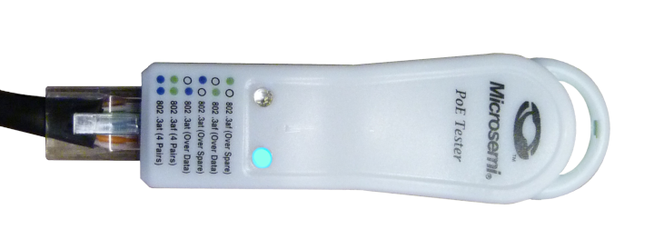

# Power over Ethernet

Power over Ethernet (POE) systems provide DC electrical power along with data on the Ethernet cable. The POE sourcing equipment can be a network switch or a midspan power injector. Midspan power injectors allow you to connect POE devices to an existing non-POE network switch.    

The IEEE 802.3 standard for Power Over Ethernet (POE) has specifications for four levels of supply power. The lowest level, 802.3af, supplies the 13W of power required for the JS-50 scanner. Basically, any POE source that meets IEEE standards will power the JS-50 scanner.  

>[!NOTE]
>Some POE network switches have powered and non-powered connections. For example, a 20 port POE switch might have 10 powered ports and 10 non-powered ports. Make sure your POE switch has a powered port for the ScanSync module and each scanner in your system.  

## Supplying Power to POE Devices
The POE source equipment only provides power when it is connected to a POE device. POE devices have a 25 kΩ resistor between the powered pairs of wires. The POE source will not enable the power supply unless it detects the correct resistance. This protects non-POE devices that are connected to the POE switch. 

The POE source also monitors power consumption. After connecting, the POE device must use at least 5-10 mA for 60 ms to continue the supply of power. If the POE device does not draw power for 400 ms, the POE source assumes the POE device is disconnected and cuts off the power. This safety feature prevents disconnected or damaged cables from accidentally short-circuiting.

## Troubleshooting POE Systems
If the Power LED on a scanner is off, you need to determine if the POE source, the cable, or the scanner is faulty. 

1. Use a POE tester to check the POE source. The tester simulates a POE device, and you can simply connect it to a standard ethernet cable to confirm that the POE source detects the tester and supplies power.  

2. Connectors are the least reliable parts of an electrical system. Disconnect the cable at the scanner and POE source and check the connector and cable for damage.  

4. Disconnect a working scanner at the POE source and swap ports. This tests the cable and scanner. 

5. Swap scanners to determine if the scanner or cable is faulty. 

>[!NOTE]
>The scanners are calibrated at the factory to align the profile output to the mounting plate and the configuration settings are stored in the control system. This allows you to swap two scanners without going through a configuration process.   

