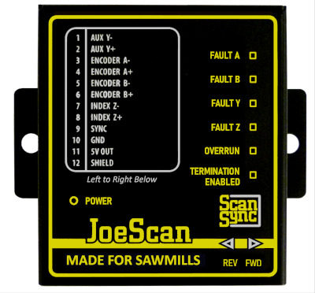
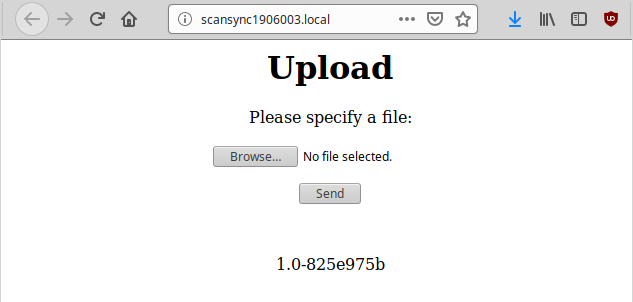

# ScanSync Module

The ScanSync module acts as the master clock for the scanners in a system. It collects the inputs from the encoders and transmits them to the control system. The control system uses the time stamp from the ScanSync module to operate the scanners. This eliminates timing issues that can occur if the system relies on the internal clock in each scanner.
>[!NOTE]
>The ScanSync module sends a continuous stream of data and the resulting broadcast traffic can cause issues with WIFI and some network devices.  
>
>Ideally, the ScanSync module is isolated to the scanner network. This can be accomplished by physical topology, by port blocking, or by VLAN. 

| LED                | Color         | Description  |  
| -------------      |---------------| -----|  
| Power              | Green         | The module is receiving power.|  
| Fault *Encoder*    | Red           | The encoder has a problem.|  
| Overrun            | Red           | The encoder data rate exceeds hardware capabilities.|  
| Termination Enabled| Yellow        | Termination resistor pairs installed. Used for long cables or high data transfer rate.|  
| REV / FWD          | Blue / Green  | The module is receiving data from the encoders| 

## Connections
The ScanSync module has a 12 pin connector for the encoders and a POE (Power over Ethernet) connector for the optimizer system. You can connect up to four encoders to the ScanSync module – A, B, Y, and Z. 

| Pin | Description   |  
| ----|---------------|  
| 1   | Aux Y-        |  
| 2   | Aux Y+        |  
| 3   | Encoder A-    |  
| 4   | Encoder A+    |  
| 5   | Encoder B-    |  
| 6   | Encoder B+    |  
| 7   | Index Z-      |  
| 8   | Index Z+      |  
| 9   | Sync          |  
| 10  | Ground        |  
| 11  | 5V Out        |  
| 12  | Shield        |  

## Firmware Version
The module has a static web page that displays the current firmware version. You can also upload a firmware file provided by JoeScan tech support.

In your browser, go to scansync*Serial_Number*.local.  
>[!NOTE]  
>The ScanSync module has a serial number label next to the 12 pin connector. 

>[!NOTE]  
>The web page requires link-local IP access on the control system computer. This should be the default on Windows.

To upload a firmware file:
1.  Click the Browse… button.
2.  Browse to the file provided by JoeScan tech support.
3.  Click Send.

