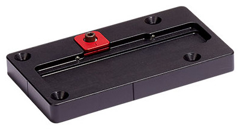
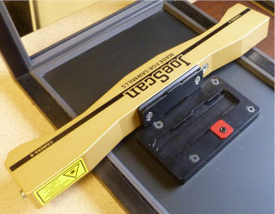

# JS-50 QuikLock Mount

The JS-50 QuikLock mount uses dovetails to accurately position the scanning head. The scanners are calibrated using the QuickLock mount, which allows you to swap a scanner without recalibrating the system.  A spring-loaded clamp plate locks the scanner head in position. Installing or removing the scanner head only requires a 3/16 hex driver, and there aren’t any loose fasteners that can get lost.

The mounting plate has a recess for the scanner head bracket with a dovetail machined into one side and a clamp plate on the other. The clamp plate positions the scanner head bracket against the dovetails and locks the bracket in place. Two ball-nose spring plungers engage slots on the scanner head bracket and retain the mounting bracket while you slide the scanner head into position. 

The scanner  bracket has three dovetails that fit into recesses in the mounting plate. Two of the dovetails engage with a dovetail machined in the mounting plate, and the clamp plate engages the third dovetail. 

## Installation  

Installing the scanner is a simple process:  
1.  Align the dovetails on the scanner mounting bracket with the mounting plate.

3.  Insert the scanner mounting bracket into the mounting plate.

5.  Slide the scanner to the end of the mounting plate.

7.  Tighten the screw on the clamp plate to align and lock the scanner head. 

