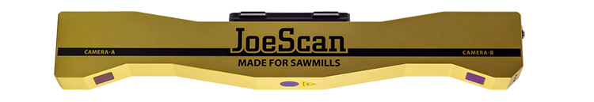
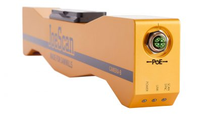
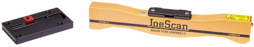

# JS-50 WX Dual Camera Scanner

## JS-50 Scanner

The scanner has a single Class 3R laser with two cameras. This improves profile detection when a single camera does not have a clear view of the object. For example, when transverse scanning a board with steep wanes, one camera or the other will detect the profile. 

The scanner has a single POE (Power over Ethernet) connection. This simplifies cable management and improves reliability. The scanner supports a 10 Gigabit uplink connection for high speed systems. The UDP protocol tolerates dropped packets unlike TCP, which requires retransmission of the data if a single packet is lost. While the data in the dropped packet is lost, the rest of the data comes through. 

In addition to the (X,Y) coordinates of each point, the JS-50 scanner also captures the luminosity. The brightness data is useful when scanning for defects such as stains, but the network transmission time for the additional data reduces the maximum scan rate. To increase the scan rate, you can configure the scanner to omit the luminosity data during transmission. For maximum scan rate, you can also reduce the percentage of data points that are transmitted. 

## ScanSync Encoder Module 

The ScanSync encoder module synchronizes the output from up to four encoders and acts as the master clock for the scanners. The module transmits the time-stamped encoder data over an Ethernet connection to the optimizer PC. 

## JS-50 QuikLock Mount

The JS-50 QuikLock mount uses dovetails to accurately position the scanning head. The scanners are calibrated using the QuikLock mount, which allows you to swap a scanner without recalibrating the system.  A spring-loaded clamp plate locks the scanner head in position. Installing or removing the scanner head only requires a 3/16 hex driver, and there aren’t any loose fasteners that can get lost.